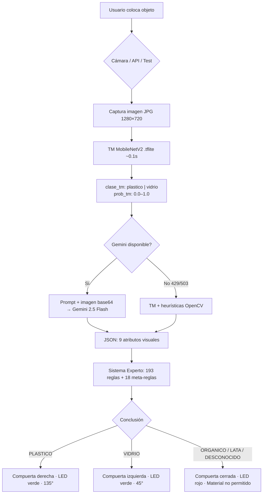

# RECI — Flujo completo de reconocimiento

Documento de referencia para la demo (visión + sistema experto + hardware).

---

## Diagrama general



---

## Paso a paso (modo demo con cámara)

| # | Componente | Archivo | Qué hace |
|---|------------|---------|----------|
| 1 | Cámara | `vision/camera.py` | Captura JPG en `images/capturas/` |
| 2 | TM | `vision/tm_classifier.py` | Inferencia TFLite → `plastico` o `vidrio` + probabilidad |
| 3 | Gemini | `vision/attribute_extractor.py` | Analiza imagen + contexto TM → 9 atributos JSON |
| 3b | Fallback | `vision/visual_heuristics.py` | Si Gemini falla: OpenCV refina atributos del TM |
| 4 | Validador | `expert_system/attribute_validator.py` | Valida que atributos sean valores permitidos |
| 5 | Meta-reglas | `expert_system/meta_rules.py` | Ajusta contexto (excluir categorías, sesgos) |
| 6 | Motor SE | `expert_system/inference_engine.py` | Forward + backward chaining → conclusión |
| 7 | Hardware | `inference_engine.decision_hardware()` | Compuerta, LED, servo, mensaje |

**Tiempo típico:** ~2–5 s con Gemini · ~0.1–0.3 s solo TM+heurísticas.

---

## Qué envía el modelo entrenado (TM) a Gemini

**Importante:** el TM **no envía la imagen procesada ni los 9 atributos del MAPA_CLASES**. Solo aporta **2 datos de texto** dentro del prompt de Gemini:

```
CONTEXTO DEL CLASIFICADOR RÁPIDO (MobileNetV2):
El modelo detectó 'plastico' con 99% de confianza.
Úsalo como referencia inicial, pero confía en tu análisis visual
si ves algo diferente — especialmente en material, brillo de tapa y textura.
```

| Dato TM | Ejemplo | ¿Se envía a Gemini? |
|---------|---------|---------------------|
| `clase_tm` | `"plastico"` o `"vidrio"` | ✅ Sí (texto en prompt) |
| `prob_tm` | `0.994` | ✅ Sí (como porcentaje en prompt) |
| Imagen original | JPG capturada | ✅ Sí (base64 en `inline_data`) |
| `objeto_reconocido` del MAPA | `botella_agua` | ❌ No |
| Atributos TM (color, tapa, etc.) | del MAPA_CLASES | ❌ No |
| Reglas del sistema experto | 193 reglas | ❌ No |

La inferencia TM cruda usa `_inferir()` **antes** de las heurísticas OpenCV, para que Gemini reciba el voto real del MobileNetV2, no el atributo ya corregido.

**Código:** `attribute_extractor.py` → `analizar_imagen_hibrido()` líneas 320–348.

---

## Payload completo a la API de Gemini

```json
{
  "contents": [{
    "parts": [
      { "text": "<PROMPT_BASE + contexto TM opcional>" },
      {
        "inline_data": {
          "mime_type": "image/jpeg",
          "data": "<imagen completa en base64>"
        }
      }
    ]
  }],
  "generationConfig": {
    "temperature": 0.1,
    "topP": 0.8,
    "maxOutputTokens": 256,
    "responseMimeType": "application/json"
  }
}
```

### Prompt (`PROMPT_BASE`)

- Instrucciones para extraer **9 atributos** con valores de lista cerrada.
- ~34 tipos de `objeto_reconocido` (botella_agua, vaso_plastico_blanco, papel_servilleta, etc.).
- Guías de desambiguación (vaso blanco vs yogur, vidrio vs plástico, etc.).

### Respuesta esperada de Gemini

```json
{
  "objeto_reconocido": "botella_agua",
  "confianza_ml": "alta",
  "transparencia": "alta",
  "color": "transparente",
  "forma": "cilindrica_estandar",
  "brillo": "medio_difuso",
  "tapa": "rosca_plastico",
  "textura": "lisa_brillante",
  "rigidez": "rigido"
}
```

---

## Los 9 atributos → Sistema experto

| Atributo | Ejemplo | Uso en SE |
|----------|---------|-----------|
| `objeto_reconocido` | `botella_gatorade` | Reglas nivel 1 (reconocimiento directo) |
| `confianza_ml` | `alta` / `media` / `baja` | Meta-reglas MR01, MR06, MR10; umbral conservador |
| `transparencia` | `alta` | Diferenciar PET vs vidrio opaco |
| `color` | `verde_oscuro` | MR16, reglas vidrio verde |
| `forma` | `cilindrica_ancha` | Vasos, bowls, botellas |
| `brillo` | `alto_nitido` vs `medio_difuso` | Vidrio vs plástico |
| `tapa` | `corona_metalica` | MR03, MR08 — señal fuerte de vidrio |
| `textura` | `fibrosa` | Papel/cartón vs plástico liso |
| `rigidez` | `flexible` | MR04 — flexible nunca es vidrio |

**Salida del SE:** `PLASTICO` | `VIDRIO` | `ORGANICO` | `LATA` | `DESCONOCIDO`

**Para la demo (solo 2 tachos):** solo `PLASTICO` y `VIDRIO` abren compuerta. El resto → mensaje de material no permitido (LED rojo, compuerta cerrada).

---

## Fallback cuando Gemini no responde

Orden de degradación:

1. **Gemini 2.5 Flash** (reintentos + modelos alternativos)
2. **Gemini 2.5 Flash-Lite**
3. **Gemini 2.0 Flash**
4. **TM + heurísticas OpenCV** (`visual_heuristics.py`)
5. Si TM también falla → error

Tras el primer fallo de Gemini en una sesión, las siguientes fotos **no reintentan la API** (cache de sesión) y van directo a TM+heurísticas (~0.1 s).

**Precisión medida sin Gemini:** 16/16 imágenes de prueba en `tests/test_imagenes_completo.py`.

---

## Costo por petición (Gemini 2.5 Flash, tier pago)

Estimación con `images/prueba1.jpeg` (121 KB, cámara típica):

| Concepto | Valor estimado |
|----------|----------------|
| Tokens prompt | ~1 320 |
| Tokens imagen | ~516 (720p, 2 tiles) |
| Tokens salida JSON | ~100–150 |
| **Costo por foto** | **~$0.0009** (~0.09 centavos USD) |

| Uso | Peticiones | Costo aprox. |
|-----|------------|--------------|
| Ensayos previos | 100 | ~$0.09 |
| Demo + pruebas grupo | 500 | ~$0.46 |
| Margen amplio | 2 000 | ~$1.85 |

Precios oficiales: [ai.google.dev/gemini-api/docs/pricing](https://ai.google.dev/gemini-api/docs/pricing)  
Tarifas Flash: **$0.30 / 1M tokens entrada** · **$2.50 / 1M tokens salida**.

Para recalcular con tus fotos:

```bash
python3 scripts/estimar_costo_gemini.py
python3 scripts/estimar_costo_gemini.py images/prueba10.jpeg
```

---

## Preparación para la demo (checklist)

### A. Gemini (recomendado para máxima precisión)

- [ ] Crear API key en [Google AI Studio](https://aistudio.google.com/apikey)
- [ ] Vincular billing (tarjeta) en el proyecto — necesario para cuota operativa
- [ ] Poner tope de gasto **$5** en Google Cloud / AI Studio
- [ ] Copiar `.env.example` → `.env` y pegar `GEMINI_API_KEY=...`
- [ ] Probar: `python3 scripts/estimar_costo_gemini.py` (verifica key + muestra costo)
- [ ] Probar flujo: `python3 tests/test_imagenes_completo.py`

### B. Sin Gemini (plan B gratuito)

- [ ] Solo necesitas `model/model.tflite` y `model/labels.txt`
- [ ] `python3 vision/camera.py` funciona con TM+heurísticas automáticamente
- [ ] Validar con las 16 fotos de `images/prueba*.jpeg`

### C. Día de la demo

- [ ] Internet estable (solo si usas Gemini)
- [ ] Cámara con permisos en macOS (Ajustes → Privacidad → Cámara)
- [ ] Iluminación uniforme sobre el objeto
- [ ] Teclas **P** / **V** en pantalla de resultado para corregir manualmente si falla

---

## Puntos de entrada del flujo

| Entrada | Función principal |
|---------|-------------------|
| `python3 vision/camera.py` | Demo en vivo con cámara |
| `POST /clasificar/imagen` | API REST (subir foto) |
| `python3 tests/test_imagenes_completo.py` | Prueba batch 16 imágenes |
| `AttributeExtractor.analizar_y_clasificar_hibrido()` | Orquestador central |
| `RECI_entrenar_automatico.ipynb` | Reentrenar MobileNetV2 (Colab, Ejecutar todo) |

---

## Documentación relacionada

| Documento | Contenido |
|-----------|-----------|
| [README.md](../README.md) | Guía principal del proyecto |
| [ENTRENAMIENTO_MODELO.md](ENTRENAMIENTO_MODELO.md) | Captura de fotos, Drive, Colab, despliegue `.tflite` |
| [diagramas/arquitectura_reci.png](diagramas/arquitectura_reci.png) | Diagrama de arquitectura (PNG) |

---

## Claude (integrado v2.6)

Configurar en `.env`:

```bash
VISION_API=claude
ANTHROPIC_API_KEY=sk-ant-...
CLAUDE_MODEL=claude-haiku-4-5   # recomendado: barato y rápido
# CLAUDE_MODEL=claude-sonnet-4-6  # más preciso, ~5-10× más caro
```

**Costo estimado con Haiku:** ~$0.001–0.002/foto (~$0.02–0.04 por test de 16 imágenes).

**Test batch sin rate limit:**
```bash
python3 tests/test_imagenes_completo.py          # pausa 2s entre fotos (default)
python3 tests/test_imagenes_completo.py --sin-pausa  # más rápido, puede activar fallback
```

Mismo contrato de **9 atributos JSON** → el sistema experto no cambia. Si Claude falla (429, red), el fallback automático es **TM + heurísticas OpenCV**. El rate limit (429) ya no desactiva Claude para el resto del batch.
